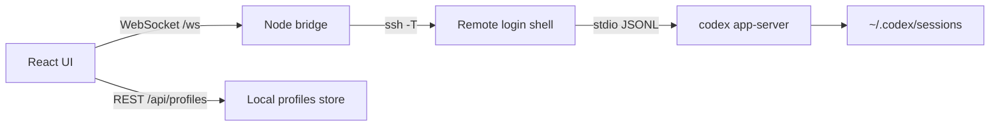

# Codex Remote

Минималистичная web-приложение в стиле Codex app для работы с Codex CLI на сервере без ручного `ssh`, `cd` и `codex --yolo`.

## Что умеет

- сохраняет SSH/local профили проектов;
- сама запускает на целевой машине `codex app-server --listen stdio://`;
- показывает историю `thread/list` из удаленного `$CODEX_HOME`;
- открывает прошлые сессии через `thread/read`;
- продолжает выбранную сессию через `thread/resume` + `turn/start`;
- стримит ответы, команды и изменения файлов через JSON-RPC notifications;
- по умолчанию повторяет привычный `codex --yolo`: `approvalPolicy=never`, `sandbox=danger-full-access`.

## Запуск

```bash
npm install
npm run dev
```

Открой:

```text
http://127.0.0.1:5173
```

## Требования к серверу

1. SSH с локальной машины должен работать без пароля: через `~/.ssh/config`, agent или `IdentityFile`.
2. На сервере должен быть установлен и авторизован `codex`.
3. Команда `codex` должна быть доступна в login shell. Приложение запускает ее так:

```bash
ssh -T devbox "bash -lc 'cd ~/app && codex app-server --listen stdio://'"
```

Пароли, OpenAI токены и ChatGPT cookies приложение не хранит.

## Архитектура



Основной принцип: не оборачивать терминал, а говорить с официальным `codex app-server` протоколом. Поэтому история и live events идут тем же путем, которым пользуются rich clients.

## Профили

Минимальный SSH-профиль:

- `SSH target`: `devbox` или `ubuntu@1.2.3.4`
- `Project path`: `/home/ubuntu/app`
- `Codex binary`: `codex`
- `Approval`: `never`
- `Sandbox`: `danger-full-access`

Профили лежат в:

```text
~/.codex-remote-console/profiles.json
```

## Проверки

```bash
npm run typecheck
npm run build
```

## Ограничения

- Web UI сейчас подключается к одному выбранному профилю за раз.
- Approval prompts пока не имеют отдельного красивого UI; для `--yolo` это не мешает.
- WebSocket transport самого Codex не используется: bridge держит `stdio://` поверх SSH, чтобы не открывать удаленный порт.

