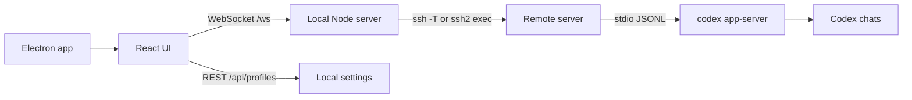

# Codex Remote

[Русская версия](README.ru.md)

Minimal desktop app for working with Codex CLI sessions on remote servers without manually running `ssh`, `cd`, and `codex --yolo` in a terminal.

## Features

- Saves projects as `server + project folder`, so one server can host multiple workspaces.
- Lets you browse server directories in the GUI and pick the project folder visually.
- Connects to a project by clicking it in the sidebar.
- Starts `codex app-server --listen stdio://` on the target machine.
- Shows Codex history from the remote `$CODEX_HOME`.
- Opens previous chats, resumes them, and starts new dialogs in the selected project.
- Pins chats locally, renames them, and hides them with confirmation.
- Collapses intermediate work into one "work progress" block and keeps the final answer readable.
- Shows changed files in final messages.
- Provides a compact command palette with `Cmd/Ctrl+K`.
- Checks whether Codex CLI is installed, shows the installed/latest version when available, and can install or update it from Settings.
- Uses a temporary SSH password only for the current connection; it is not stored.
- Runs with the default project profile close to `codex --yolo`: `approvalPolicy=never`, `sandbox=danger-full-access`.
- Ships as an Electron app for macOS, Windows, and Linux.

## Running Locally

Install dependencies and start the Electron app:

```bash
npm install
npm run electron:dev
```

Run only the web UI and local server:

```bash
npm install
npm run dev
```

Open:

```text
http://127.0.0.1:5173
```

## Building

Build for the current platform:

```bash
npm run dist
```

Build specific targets:

```bash
npm run dist:mac
npm run dist:win
npm run dist:linux
```

Artifacts are written to `release/`. Cross-building Windows or Linux artifacts from macOS may require additional system tooling.

## Server Requirements

1. SSH from the local machine to the target server must work through `~/.ssh/config`, SSH agent, an identity file, or a one-time password entered in the app.
2. The project folder must exist and be readable by the SSH user.
3. Codex CLI must be available in the remote login shell as `codex` or through the custom command configured in the project.
4. Codex must already be authenticated on that server.

The app starts the remote app-server roughly like this:

```bash
ssh -T devbox "bash -lc 'cd ~/app && codex app-server --listen stdio://'"
```

Passwords, OpenAI tokens, and ChatGPT cookies are not stored by Codex Remote.

## If Codex CLI Is Not Installed

Codex Remote handles this as a first-class state:

1. Open the project or Settings.
2. Click `Check` in `Settings -> Codex`.
3. If `codex` is missing, the status becomes `not installed`.
4. Click `Install`.
5. Reconnect to the project after installation finishes.

The default install/update command follows the current Codex CLI setup path for macOS/Linux and keeps the old npm package as a fallback:

```bash
(set -o pipefail; curl -fsSL https://chatgpt.com/codex/install.sh | CODEX_NON_INTERACTIVE=1 sh) || npm install -g @openai/codex@latest
```

You can override this command globally in `Settings -> Codex` or per project in the advanced project settings.

Official setup reference: [OpenAI Codex CLI](https://developers.openai.com/codex/cli).

## Architecture



The app is not a terminal wrapper. It talks to `codex app-server`, so chat history and live events come through the same app-server interface used by full Codex clients.

## Projects

A minimal project includes:

- server: `devbox` or `ubuntu@1.2.3.4`
- project folder: selected in the app, for example `/var/www/site.com`
- Codex command: `codex`
- SSH password: optional and never saved
- install/update command: optional per-server override

The same server can contain several projects, for example `/var/www/zavozik.xyz` and `/var/www/hytalemonitoring.com`. They are grouped under the same server in the sidebar.

Profiles, preferences, and local chat pins are stored in:

```text
~/.codex-remote-console/profiles.json
```

## Appearance

`Settings -> Appearance` has three interface styles:

- `Default`: closest to the calm Codex app layout.
- `Chats`: gives more weight to history and resumed sessions.
- `Terminal`: darker sidebar and a more engineering-oriented rhythm.

Light, dark, and system themes are supported.

## Checks

```bash
npm run typecheck
npm run build
npm run electron:dev
```

## Shortcuts and Actions

- `Cmd/Ctrl+K`: command palette for a new dialog, settings, project creation, refresh, reconnect, CLI check, and disconnect.
- Right-click a chat: pin, rename, or delete with confirmation.
- Click a project: connect immediately.

## Current Limitations

- Only one project connection is active at a time.
- Approval requests do not yet have a dedicated polished dialog. This does not affect the default full-access mode.
- Remote communication uses `stdio://` over SSH, so no remote TCP port needs to be opened.
- SSH keys or `~/.ssh/config` are recommended for regular use.
