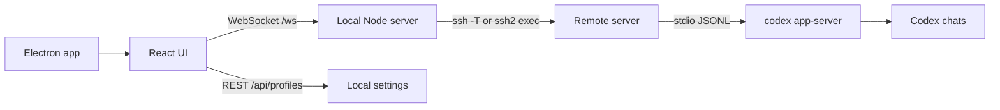

# Codex Remote

[Русская версия](README.ru.md)

Minimal desktop app for working with Codex CLI sessions on remote servers without manually running `ssh`, `cd`, and `codex --yolo` in a terminal.

## Features

- Saves projects as `server + project folder`, so one server can host multiple workspaces.
- Lets you browse server directories in the GUI and pick the project folder visually.
- Browses project files, searches project paths, previews text files, copies paths/content, attaches selected files to a task, and opens per-file diff.
- Connects to a project by clicking it in the sidebar.
- Opens a project in a separate Electron window with an independent Codex connection, so tasks can run in parallel across projects.
- Starts `codex app-server --listen stdio://` on the target machine.
- Shows Codex history from the remote `$CODEX_HOME`.
- Opens previous chats, resumes them, and starts new dialogs in the selected project.
- Pins chats locally, renames them, and hides them with confirmation.
- Collapses intermediate work into one "work progress" block and keeps the final answer readable.
- Queues a new task while Codex is busy instead of accidentally starting overlapping work.
- Keeps per-chat drafts, open chat tabs, and a persistent task center with running, attention, and completed states.
- Restores an unfinished task state after app restart and offers reconnect/refresh actions.
- Shows a compact task summary with elapsed time, token usage, touched files, commands, and checks.
- Opens changed files in an integrated diff viewer.
- Provides a project workbench for Git status/stage/unstage/commit/push, branches, server processes, logs, services, and the root `AGENTS.md`.
- Creates a non-destructive hidden Git checkpoint before each task using a temporary index, including new non-ignored files without changing the real stage or worktree.
- Runs a structured project health check for SSH, folder access, read/write permissions, Codex CLI, app-server command support, git state, package scripts, available checks, and recent logs.
- Stores per-project quick commands and runs them from the GUI.
- Keeps a hidden terminal drawer for project commands and diagnostic output.
- Provides task templates for project check, production fix, release, review, and UI improvement.
- Shows a task timeline with messages, actions, commands, files, time, and token usage.
- Keeps a quiet local event journal for connection, history, errors, Codex updates, and commands.
- Reconnects automatically when the SSH/app-server connection drops.
- Shows changed files in final messages.
- Provides a compact command palette with `Cmd/Ctrl+K`.
- Provides slash commands such as `/diff`, `/status`, `/commands`, `/review`, `/compact`, `/doctor`, `/features`, `/mcp`, `/plugins`, and `@file` mentions.
- Supports file/image attachments from paste, drag-and-drop, or file picker. Images are sent as native Codex image input; selected project files are sent as native mentions.
- Shows app-server approval requests for commands, file changes, permissions, and MCP elicitations instead of leaving the task stuck.
- Uses native `review/start` for `/review` and the command palette review action.
- Shows MCP servers in a native panel and routes `mcp add/login/remove` through the command runner.
- Lets you browse archived sessions and unarchive chats from the context menu.
- Checks whether Codex CLI is installed, shows the installed/latest version when available, and can install or update it from Settings.
- Checks application releases from Settings and supports `stable` and `preview` update channels.
- Exports and imports project profiles without passwords or local secret-store data.
- Uses a temporary SSH password for the current connection by default, with optional Electron safeStorage saving per project.
- Runs with the default project profile close to `codex --yolo`: `approvalPolicy=never`, `sandbox=danger-full-access`.
- Ships as an Electron app for macOS, Windows, and Linux.

## Running Locally

Install dependencies and start the Electron app:

```bash
npm install
npm run electron:dev
```

Run only the web UI and local server:

```bash
npm install
npm run dev
```

Open:

```text
http://127.0.0.1:5173
```

## Building

Build for the current platform:

```bash
npm run dist
```

Build specific targets:

```bash
npm run dist:mac
npm run dist:win
npm run dist:linux
```

Artifacts are written to `release/`. Cross-building Windows or Linux artifacts from macOS may require additional system tooling.

## Server Requirements

1. SSH from the local machine to the target server must work through `~/.ssh/config`, SSH agent, an identity file, or a one-time password entered in the app.
2. The project folder must exist and be readable by the SSH user.
3. Codex CLI must be available in the remote login shell as `codex` or through the custom command configured in the project.
4. Codex must already be authenticated on that server.

The app starts the remote app-server roughly like this:

```bash
ssh -T devbox "bash -lc 'cd ~/app && codex app-server --listen stdio://'"
```

Passwords are not stored unless you explicitly save a project password in `Settings -> Server`.
Saved passwords use Electron `safeStorage` and stay on the local machine. OpenAI tokens and ChatGPT cookies are not stored by Codex Remote.

## If Codex CLI Is Not Installed

Codex Remote handles this as a first-class state:

1. Open the project or Settings.
2. Click `Check` in `Settings -> Codex`.
3. If `codex` is missing, the status becomes `not installed`.
4. Click `Install`.
5. Reconnect to the project after installation finishes.

The default install/update command follows the current Codex CLI setup path for macOS/Linux and keeps the old npm package as a fallback:

```bash
(set -o pipefail; curl -fsSL https://chatgpt.com/codex/install.sh | CODEX_NON_INTERACTIVE=1 sh) || npm install -g @openai/codex@latest
```

You can override this command globally in `Settings -> Codex` or per project in the advanced project settings.

Official setup reference: [OpenAI Codex CLI](https://developers.openai.com/codex/cli).

## Architecture



The app is not a terminal wrapper. It talks to `codex app-server`, so chat history and live events come through the same app-server interface used by full Codex clients.
Each Electron window has its own WebSocket and Codex bridge. The local HTTP backend and encrypted profile store are shared, while remote tasks remain independent.

## Projects

A minimal project includes:

- server: `devbox` or `ubuntu@1.2.3.4`
- project folder: selected in the app, for example `/var/www/site.com`
- Codex command: `codex`
- SSH password: optional; only saved when explicitly requested in Settings
- install/update command: optional per-server override

The same server can contain several projects, for example `/var/www/zavozik.xyz` and `/var/www/hytalemonitoring.com`. They are grouped under the same server in the sidebar.

Profiles, preferences, and local chat pins are stored in:

```text
~/.codex-remote-console/profiles.json
```

## Appearance

`Settings -> Appearance` has three interface styles:

- `Default`: closest to the calm Codex app layout.
- `Chats`: gives more weight to history and resumed sessions.
- `Terminal`: darker sidebar and a more engineering-oriented rhythm.

Light, dark, and system themes are supported.

## Codex CLI Coverage

Implemented in the GUI:

- `resume`, `fork`, `archive`, `delete`: available through chat history and the chat context menu.
- `model`, reasoning, speed, approvals, sandbox: available in the composer/project settings.
- `doctor` and `features list`: available through `/doctor`, `/features`, and `Cmd/Ctrl+K`.
- `review`: available through native `review/start` from `/review` and the command palette.
- project commands: available through `/commands` and the project command runner.
- diff/project status: available through `/diff` and `/status`.
- project files: available through `/files`, `Cmd/Ctrl+K`, and `@file` mentions.
- MCP: available through the native MCP panel, `/mcp`, and command runner shortcuts.
- `plugin`, `cloud`, `apply`, `login`, `logout`, `app-server`, `remote-control`, `sandbox`, `completion`, and `exec-server`: available through command runner shortcuts and slash commands.
- image input: available through paste, drag-and-drop, and file picker.
- approvals: command, file-change, permission, and MCP approval requests are shown in-app.
- workspace tools: Git operations, project runtime, logs, services, and root instructions are available from the Project panel.

Still intentionally not mirrored as separate polished screens:

- Plugin marketplace management, guided Codex Cloud flows, and guided `apply` are intentionally exposed through the command runner first. Full wizards can be added later without changing the app-server bridge.
- Signed background self-update is not enabled for unsigned local builds; Settings can check the latest release and open the release page.
- Signed auto-update for the app itself is not included in the unsigned local release build.

## Checks

```bash
npm run typecheck
npm run test:task-protocol
npm run test:message-history
npm run test:project-tools
npm run test:shell
npm run smoke:ssh
npm run build
npm run qa:release
npm run electron:dev
```

`npm run test:shell` runs the file/tree/search/diff/health shell paths against a temporary local project.
`npm run test:message-history` covers app-server ghost turns and prevents repeated user messages in restored history.
`npm run test:project-tools` validates Git stage/unstage/commit/push paths and guarded `AGENTS.md` writes in a temporary repository.
`npm run smoke:ssh` starts the production server on a temporary local port and checks the saved SSH profile through the real HTTP API. Set `CODEX_REMOTE_SMOKE_PROFILE_ID`, `CODEX_REMOTE_SMOKE_FILE`, or `CODEX_REMOTE_SMOKE_PASSWORD` when the default profile is not enough.
`npm run qa:release` checks version consistency, icons, npm scripts, and release artifacts for the current app version.

## Shortcuts and Actions

- `Cmd/Ctrl+K`: command palette for a new dialog, settings, project creation, refresh, reconnect, CLI check, and disconnect.
- `Cmd/Ctrl+J`: task center.
- `Cmd/Ctrl+Shift+G`: project workbench.
- Right-click a chat: pin, rename, or delete with confirmation.
- Click a project: connect immediately.
- `New window`: open the selected project with an independent Codex connection.

## Current Limitations

- One project connection is active per window; use `New window` for parallel work.
- Guided plugin marketplace and Codex Cloud flows still use the command runner rather than dedicated wizards.
- Remote communication uses `stdio://` over SSH, so no remote TCP port needs to be opened.
- SSH keys or `~/.ssh/config` are recommended for regular use.
