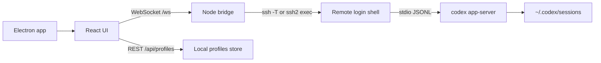

# Codex Remote

Минималистичное desktop-приложение в стиле Codex app для работы с Codex CLI на сервере без ручного `ssh`, `cd` и `codex --yolo`.

## Что умеет

- сохраняет SSH/local профили проектов;
- сама запускает на целевой машине `codex app-server --listen stdio://`;
- работает как Electron app на macOS, Windows и Linux;
- показывает историю `thread/list` из удаленного `$CODEX_HOME`;
- открывает прошлые сессии через `thread/read`;
- продолжает выбранную сессию через `thread/resume` + `turn/start`;
- стримит ответы, команды и изменения файлов через JSON-RPC notifications;
- поддерживает одноразовый SSH password input без сохранения пароля;
- проверяет установленную/последнюю версию `codex-cli` и запускает обновление кнопкой;
- имеет настройки темы, интерфейс-концепта, анимаций, истории, diagnostics и поведения composer;
- по умолчанию повторяет привычный `codex --yolo`: `approvalPolicy=never`, `sandbox=danger-full-access`.

## Запуск

Desktop dev:

```bash
npm install
npm run electron:dev
```

Web/backend dev:

```bash
npm install
npm run dev
```

Открой:

```text
http://127.0.0.1:5173
```

## Сборка приложений

Текущая платформа:

```bash
npm run dist
```

Отдельные targets:

```bash
npm run dist:mac
npm run dist:win
npm run dist:linux
```

Артефакты появляются в `release/`. Для Windows/Linux cross-build с macOS могут понадобиться внешние инструменты electron-builder, например Wine или Linux builder environment.

## Требования к серверу

1. SSH с локальной машины должен работать через `~/.ssh/config`, agent, `IdentityFile` или одноразовый password input в приложении.
2. На сервере должен быть установлен и авторизован `codex`.
3. Команда `codex` должна быть доступна в login shell. Приложение запускает ее так:

```bash
ssh -T devbox "bash -lc 'cd ~/app && codex app-server --listen stdio://'"
```

Пароли, OpenAI токены и ChatGPT cookies приложение не хранит. Password auth через встроенный `ssh2` используется только на время текущего подключения.

## Архитектура



Основной принцип: не оборачивать терминал, а говорить с официальным `codex app-server` протоколом. Поэтому история и live events идут тем же путем, которым пользуются rich clients.

## Профили

Минимальный SSH-профиль:

- `SSH target`: `devbox` или `ubuntu@1.2.3.4`
- `Project path`: `/home/ubuntu/app`
- `Codex binary`: `codex`
- `Approval`: `never`
- `Sandbox`: `danger-full-access`
- `Password`: опционально, не сохраняется
- `Codex update command`: опционально, переопределяет команду обновления для конкретного сервера

Профили лежат в:

```text
~/.codex-remote-console/profiles.json
```

Default update command:

```bash
CODEX_NON_INTERACTIVE=1 codex update || npm install -g @openai/codex@latest
```

## Внешний вид

В `Настройки -> Внешний вид` доступны три концепта интерфейса:

- `Native`: максимально близко к спокойному Codex app shell.
- `Sessions`: больше веса у истории и продолжения прошлых сессий.
- `Terminal`: темный серверный sidebar и более инженерный рабочий ритм.

## Проверки

```bash
npm run typecheck
npm run build
npm run electron:dev
```

## Ограничения

- Web UI сейчас подключается к одному выбранному профилю за раз.
- Approval prompts пока не имеют отдельного красивого UI; для `--yolo` это не мешает.
- WebSocket transport самого Codex не используется: bridge держит `stdio://` поверх SSH, чтобы не открывать удаленный порт.
- Password auth через `ssh2` не использует системный OpenSSH known_hosts flow; для production предпочтительнее ключи/SSH config.
