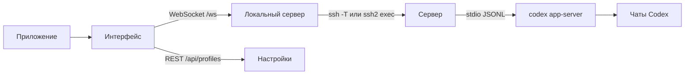

# Codex Remote

Минималистичное приложение в стиле Codex app для работы с Codex на сервере без ручного `ssh`, `cd` и `codex --yolo`.

## Что умеет

- сохраняет проекты: один сервер может иметь несколько рабочих папок;
- показывает папки сервера прямо в приложении, чтобы выбрать место работы без ручного ввода пути;
- сама запускает на целевой машине `codex app-server --listen stdio://`;
- работает на macOS, Windows и Linux;
- группирует проекты по серверам и показывает чаты выбранной папки;
- показывает историю `thread/list` из удаленного `$CODEX_HOME`;
- открывает прошлые чаты;
- продолжает выбранный чат;
- создает новый диалог в выбранном проекте;
- закрепляет важные чаты локально в интерфейсе;
- показывает ответы, команды и изменения файлов в реальном времени;
- использует одноразовый пароль SSH без сохранения;
- проверяет установленную/последнюю версию `codex-cli` и запускает обновление кнопкой;
- имеет настройки темы, анимаций, истории, журнала и ввода;
- по умолчанию повторяет привычный `codex --yolo`: `approvalPolicy=never`, `sandbox=danger-full-access`.

## Запуск

Разработка приложения:

```bash
npm install
npm run electron:dev
```

Разработка через браузер:

```bash
npm install
npm run dev
```

Открой:

```text
http://127.0.0.1:5173
```

## Сборка приложений

Текущая платформа:

```bash
npm run dist
```

Отдельные targets:

```bash
npm run dist:mac
npm run dist:win
npm run dist:linux
```

Артефакты появляются в `release/`. Для сборки Windows/Linux на macOS могут понадобиться дополнительные инструменты.

## Требования к серверу

1. SSH с локальной машины должен работать через `~/.ssh/config`, agent, ключ или одноразовый пароль в приложении.
2. На сервере должен быть установлен и авторизован `codex`.
3. Команда `codex` должна быть доступна в login shell. Приложение запускает ее так:

```bash
ssh -T devbox "bash -lc 'cd ~/app && codex app-server --listen stdio://'"
```

Пароли, OpenAI токены и ChatGPT cookies приложение не хранит. Пароль SSH используется только на время текущего подключения.

## Архитектура



Основной принцип: приложение не оборачивает терминал, а говорит с `codex app-server`. Поэтому история и события чата идут тем же путем, которым пользуются полноценные клиенты Codex.

## Проекты

Минимальный проект:

- сервер: `devbox` или `ubuntu@1.2.3.4`
- папка проекта: выбирается в приложении, например `/var/www/site.com`
- команда Codex: `codex`
- пароль: опционально, не сохраняется
- команда обновления Codex: опционально, для конкретного сервера

Один и тот же сервер можно использовать для нескольких папок, например `/var/www/zavozik.xyz` и `/var/www/hytalemonitoring.com`. В боковой панели они будут сгруппированы под одним сервером.

Проекты, настройки и локальные закрепления чатов лежат в:

```text
~/.codex-remote-console/profiles.json
```

Команда обновления по умолчанию:

```bash
CODEX_NON_INTERACTIVE=1 codex update || npm install -g @openai/codex@latest
```

## Внешний вид

В `Настройки -> Внешний вид` доступны три режима интерфейса:

- `Обычный`: максимально близко к спокойному Codex app.
- `Чаты`: больше веса у истории и продолжения прошлых чатов.
- `Терминал`: темная боковая панель и более инженерный рабочий ритм.

## Проверки

```bash
npm run typecheck
npm run build
npm run electron:dev
```

## Ограничения

- Сейчас приложение подключается к одному выбранному проекту за раз.
- Запросы подтверждений пока без отдельного красивого окна; для режима `--yolo` это не мешает.
- Приложение держит `stdio://` поверх SSH, чтобы не открывать удаленный порт.
- Для постоянной работы предпочтительнее SSH-ключи или `~/.ssh/config`.
