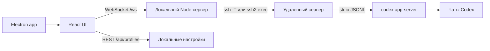

# Codex Remote

[English version](README.md)

Минималистичное настольное приложение для работы с Codex CLI на удаленных серверах без ручного `ssh`, `cd` и `codex --yolo` в терминале.

## Что умеет

- Сохраняет проекты как связку `сервер + папка проекта`, поэтому один сервер может иметь несколько рабочих папок.
- Показывает папки сервера прямо в интерфейсе и позволяет выбрать директорию проекта визуально.
- Показывает файлы проекта, умеет предпросмотр текстовых файлов, вложение файла в задачу и diff по файлу.
- Подключается к проекту по клику в боковой панели.
- Запускает на целевой машине `codex app-server --listen stdio://`.
- Показывает историю Codex из удаленного `$CODEX_HOME`.
- Открывает прошлые чаты, продолжает их и создает новые диалоги в выбранном проекте.
- Закрепляет чаты локально, переименовывает их и скрывает с подтверждением.
- Сворачивает промежуточный ход работы в один блок и оставляет итоговый ответ читаемым.
- Ставит новую задачу в очередь, если Codex уже занят, вместо случайного параллельного запуска.
- После перезапуска показывает незавершенную задачу и предлагает переподключиться или обновить чат.
- Показывает компактный итог задачи: время, токены, файлы, команды и проверки.
- Открывает затронутые файлы во встроенном diff viewer.
- Проверяет проект: git-состояние, package scripts, доступные проверки и последние логи.
- Хранит быстрые команды проекта и запускает их из GUI.
- Держит скрытый terminal drawer для команд проекта и диагностического вывода.
- Дает шаблоны задач: проверка проекта, починка прода, релиз, review и улучшение UI.
- Показывает timeline задачи: сообщения, действия, команды, файлы, время и токены.
- Ведет тихий локальный журнал событий: подключения, история, ошибки, обновления Codex и команды.
- Автоматически переподключается, если SSH/app-server отвалился.
- Показывает затронутые файлы в итоговых сообщениях.
- Открывает палитру команд через `Cmd/Ctrl+K`.
- Поддерживает slash-команды `/diff`, `/status`, `/commands`, `/review`, `/compact`, `/doctor`, `/features`, `/mcp`, `/plugins` и упоминания файлов через `@`.
- Поддерживает вложения через paste, drag-and-drop и выбор файла. Картинки уходят как native Codex image input; выбранные файлы проекта уходят как native mentions.
- Показывает approval-запросы app-server для команд, изменений файлов, расширения прав и MCP elicitations, чтобы задача не зависала молча.
- Использует native `review/start` для `/review` и действия review в палитре команд.
- Показывает MCP серверы в отдельной панели, а `mcp add/login/remove` запускает через runner команд.
- Показывает архивные сессии и умеет восстанавливать чаты из контекстного меню.
- Проверяет, установлен ли Codex CLI, показывает установленную/последнюю версию, если ее удалось получить, и умеет установить или обновить CLI из настроек.
- Проверяет релизы приложения из настроек и поддерживает каналы `stable` и `preview`.
- По умолчанию использует одноразовый SSH-пароль только для текущего подключения; при желании пароль проекта можно сохранить через Electron safeStorage.
- По умолчанию близко повторяет привычный режим `codex --yolo`: `approvalPolicy=never`, `sandbox=danger-full-access`.
- Собирается как Electron-приложение для macOS, Windows и Linux.

## Запуск локально

Установить зависимости и запустить Electron-приложение:

```bash
npm install
npm run electron:dev
```

Запустить только web-интерфейс и локальный сервер:

```bash
npm install
npm run dev
```

Открыть:

```text
http://127.0.0.1:5173
```

## Сборка

Сборка под текущую платформу:

```bash
npm run dist
```

Отдельные targets:

```bash
npm run dist:mac
npm run dist:win
npm run dist:linux
```

Артефакты появляются в `release/`. Для сборки Windows или Linux на macOS могут понадобиться дополнительные системные инструменты.

## Требования к серверу

1. SSH с локальной машины должен работать через `~/.ssh/config`, agent, ключ или одноразовый пароль в приложении.
2. Папка проекта должна существовать и быть доступна SSH-пользователю.
3. Codex CLI должен быть доступен в remote login shell как `codex` или через кастомную команду проекта.
4. Codex должен быть заранее авторизован на этом сервере.

Приложение запускает удаленный app-server примерно так:

```bash
ssh -T devbox "bash -lc 'cd ~/app && codex app-server --listen stdio://'"
```

Пароли не сохраняются, пока вы явно не нажмете сохранение пароля проекта в `Настройки -> Сервер`.
Сохраненные пароли шифруются через Electron `safeStorage` и остаются на локальной машине. OpenAI токены и ChatGPT cookies Codex Remote не хранит.

## Если на сервере не установлен Codex CLI

Это отдельный поддержанный сценарий:

1. Откройте проект или настройки.
2. Нажмите `Проверить` в `Настройки -> Codex`.
3. Если `codex` отсутствует, статус станет `не установлен`.
4. Нажмите `Установить`.
5. После установки подключитесь к проекту снова.

Команда установки/обновления по умолчанию использует актуальный способ установки Codex CLI для macOS/Linux и оставляет старый npm-пакет как fallback:

```bash
(set -o pipefail; curl -fsSL https://chatgpt.com/codex/install.sh | CODEX_NON_INTERACTIVE=1 sh) || npm install -g @openai/codex@latest
```

Команду можно переопределить глобально в `Настройки -> Codex` или для конкретного проекта в расширенных настройках проекта.

Официальная инструкция: [OpenAI Codex CLI](https://developers.openai.com/codex/cli).

## Архитектура



Приложение не оборачивает терминал. Оно говорит с `codex app-server`, поэтому история чатов и события идут через тот же app-server интерфейс, который используют полноценные клиенты Codex.

## Проекты

Минимальный проект:

- сервер: `devbox` или `ubuntu@1.2.3.4`
- папка проекта: выбирается в приложении, например `/var/www/site.com`
- команда Codex: `codex`
- SSH-пароль: опционально; сохраняется только по явному действию в настройках
- команда установки/обновления: опционально, для конкретного сервера

Один и тот же сервер можно использовать для нескольких папок, например `/var/www/zavozik.xyz` и `/var/www/hytalemonitoring.com`. В боковой панели они будут сгруппированы под одним сервером.

Проекты, настройки и локальные закрепления чатов лежат в:

```text
~/.codex-remote-console/profiles.json
```

## Внешний вид

В `Настройки -> Внешний вид` доступны три режима интерфейса:

- `Обычный`: ближе всего к спокойному Codex app.
- `Чаты`: больше веса у истории и продолжения прошлых чатов.
- `Терминал`: темная боковая панель и более инженерный рабочий ритм.

Поддерживаются светлая, темная и системная темы.

## Покрытие Codex CLI

Уже вынесено в GUI:

- `resume`, `fork`, `archive`, `delete`: доступны через историю чатов и контекстное меню чата.
- `model`, рассуждение, скорость, подтверждения, sandbox: доступны в composer/project settings.
- `doctor` и `features list`: доступны через `/doctor`, `/features` и `Cmd/Ctrl+K`.
- `review`: доступен через native `review/start` из `/review` и палитры команд.
- команды проекта: доступны через `/commands` и runner команд.
- diff/status проекта: доступны через `/diff` и `/status`.
- файлы проекта: доступны через `/files`, `Cmd/Ctrl+K` и `@file` mentions.
- MCP: доступен через отдельную MCP-панель, `/mcp` и shortcuts runner команд.
- `plugin`, `cloud`, `apply`, `login`, `logout`, `app-server`, `remote-control`, `sandbox`, `completion` и `exec-server`: доступны через shortcuts runner команд и slash-команды.
- image input: доступен через paste, drag-and-drop и выбор файла.
- approvals: запросы на команды, изменения файлов, права и MCP показываются внутри приложения.

Пока осознанно не вынесено в отдельные отполированные экраны:

- Управление plugin marketplace, полноценные мастера Codex Cloud и `apply` сначала вынесены через runner команд. Полные мастера можно добавить позже без смены app-server bridge.
- Подписанный фоновый self-update не включен для локальной неподписанной сборки; настройки умеют проверить последний релиз и открыть страницу релиза.

## Проверки

```bash
npm run typecheck
npm run build
npm run electron:dev
```

## Горячие действия

- `Cmd/Ctrl+K`: палитра команд для нового диалога, настроек, добавления проекта, обновления чатов, переподключения, проверки CLI и отключения.
- Правый клик по чату: закрепить, переименовать или удалить с подтверждением.
- Клик по проекту: сразу подключиться.

## Ограничения

- Сейчас активно только одно подключение к проекту за раз.
- Для запросов подтверждений пока нет отдельного отполированного окна. На дефолтный full-access режим это не влияет.
- Удаленная связь идет через `stdio://` поверх SSH, поэтому удаленный TCP-порт открывать не нужно.
- Для регулярной работы лучше использовать SSH-ключи или `~/.ssh/config`.
