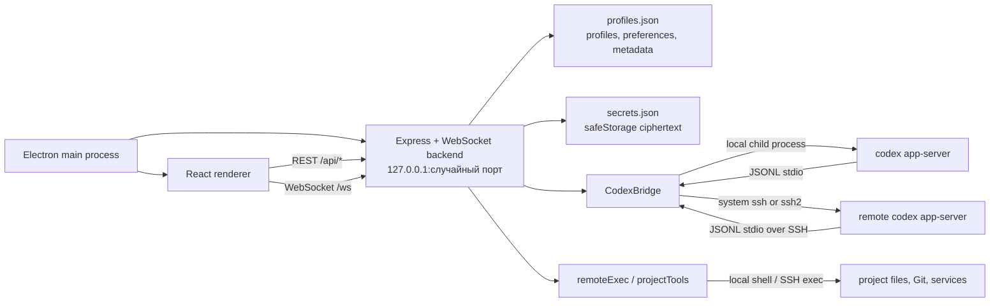
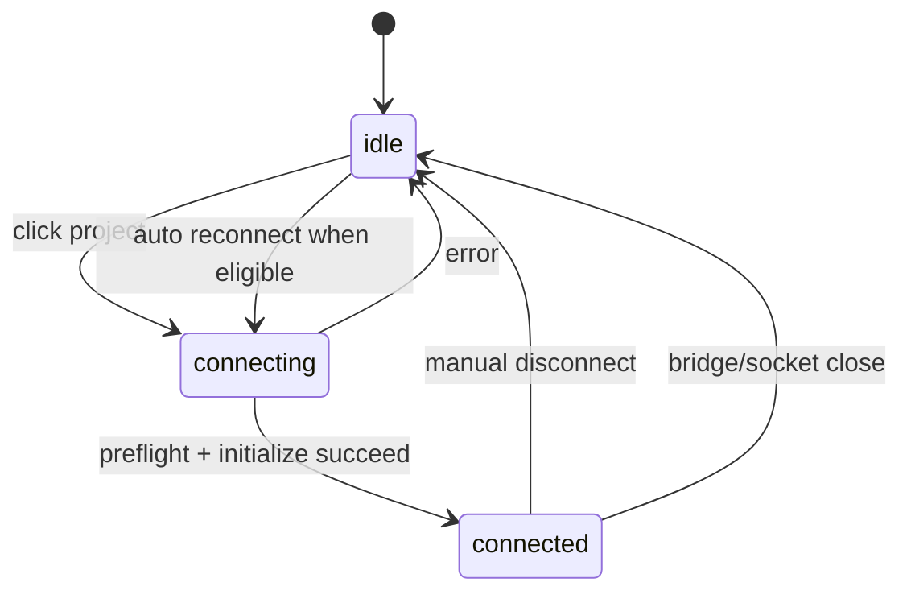

# Codex Remote: полная база знаний проекта

Дата актуализации: 2026-08-02

Версия приложения на момент среза: `1.5.2`

Ветка: `main`. Последний коммит: `5992d28` ("Release Codex Remote 1.5.1 UI
fixes"). **Важно**: этот документ описывает текущее рабочее дерево, а не сам
коммит `5992d28` — с этого коммита накоплены большие незакоммиченные изменения
(Windows-фикс, полный Apple-style redesign, цветовая чистка, контекстное меню
проекта; см. `git status`/`git diff --stat` и свежие записи в `CHANGELOG.md`
для точного списка файлов). Если предстоит `git checkout`/`git stash`/новый
worktree — сначала свериться с `git status`, иначе можно потерять эти правки:
они нигде не закоммичены и не запушены.

Этот документ предназначен для разработчиков и автономных агентов. Он является
канонической картой проекта: что именно построено, как проходят данные, где
находятся границы безопасности, какие контракты нельзя ломать и как проверять
изменения.

## 1. Краткая модель продукта

Codex Remote — кроссплатформенное Electron-приложение для работы с Codex CLI в
локальных и удаленных проектах. Пользователь сохраняет проект как связку:

- способ подключения: `ssh` или `local`;
- SSH target и параметры подключения, если проект удаленный;
- абсолютная рабочая папка проекта;
- команда Codex CLI;
- модель, sandbox, approvals и быстрые команды проекта.

Приложение:

1. Запускает локальный Node backend только на loopback.
2. Подключается к проекту локально или через SSH.
3. Запускает в целевой папке `codex app-server --listen stdio://`.
4. Общается с app-server по JSONL JSON-RPC через stdin/stdout.
5. Получает историю Codex через `thread/list` и `thread/read`.
6. Продолжает существующие чаты через `thread/resume` и `turn/start`.
7. Отображает streaming-события, approvals, команды, файлы и итог задачи.
8. Отдельно предоставляет инструменты проекта: файлы, diff, health-check, Git,
   процессы, сервисы, логи и редактирование корневого `AGENTS.md`.

Это не эмулятор терминала и не парсер transcript-файлов. Источником истины для
чатов и live-событий является Codex app-server.

## 2. Runtime-топология



### Один backend, независимые окна

- Electron запускает один локальный backend на случайном свободном порту.
- Каждое окно загружает URL этого backend.
- Каждое окно создает собственный WebSocket `/ws`.
- На каждый WebSocket создается не более одного `CodexBridge`.
- Поэтому в одном окне активно одно подключение, а параллельные проекты
  открываются в отдельных окнах.
- Профили, preferences и secret store общие для всех окон.

### Границы процессов

1. **Electron main**: окно, меню, about, IPC, запуск/остановка backend.
2. **Renderer**: интерфейс и локальное состояние рабочего пространства.
3. **Local backend**: доверенная граница между sandboxed renderer и ОС/SSH.
4. **Remote shell**: команды от имени SSH-пользователя.
5. **Codex app-server**: threads, turns, items, approvals и model catalog.

### Репозиторий и публикация

- GitHub: `rub1kub/codex-remote-console`.
- На момент среза репозиторий публичный.
- `private: true` в `package.json` запрещает случайную публикацию пакета в npm,
  но не управляет видимостью GitHub-репозитория.
- `main`, `origin/main` и tag `v1.5.1` указывают на commit `5992d28`; локальное
  рабочее дерево ушло от него вперед незакоммиченными изменениями (см. шапку
  документа) и ещё не запушено.
- В tracked tree нет GitHub Actions и нет файла `LICENSE`.
- Отсутствие LICENSE означает, что публичный просмотр кода сам по себе не задает
  явных прав на распространение и модификацию.

## 3. Карта репозитория

| Путь | Ответственность |
|---|---|
| `electron/main.cjs` | Electron lifecycle, окна, native menu, about, IPC, backend |
| `electron/preload.cjs` | Узкий IPC API `window.codexRemote.openWorkspace()` |
| `server/index.ts` | Express routes, loopback security, WebSocket protocol |
| `server/codexBridge.ts` | JSON-RPC transport и методы Codex app-server |
| `server/remoteExec.ts` | SSH/local shell, CLI status/install, project read APIs |
| `server/projectTools.ts` | Git mutations, checkpoints, runtime, `AGENTS.md` |
| `server/profiles.ts` | Profiles, preferences, thread metadata, import/export |
| `server/secrets.ts` | Пароли, зашифрованные Electron safeStorage |
| `server/types.ts` | Серверные контракты |
| `src/App.tsx` | Главный state machine и продуктовые workflow |
| `src/ProjectWorkbench.tsx` | Git, branches, runtime, logs, instructions |
| `src/TaskCenter.tsx` | Постоянный список задач рабочего пространства |
| `src/WorkspaceTabs.tsx` | Открытые чаты и переходы между проектами |
| `src/taskProtocol.ts` | Корреляция turn events и завершение active task |
| `src/messageHistory.ts` | Нормализация восстановленной истории без дублей |
| `src/modelCatalog.ts` | Fallback-модели и capability-aware picker |
| `src/workspaceState.ts` | Версионированное localStorage-состояние |
| `src/types.ts` | Клиентские и wire-контракты |
| `src/styles.css` | Базовый/исторический CSS |
| `src/redesign.css` | Текущая визуальная система и финальные overrides |
| `scripts/` | Unit/integration/UI/live smoke/release QA |
| `docs/codex-cli-knowledge-base.md` | Подробности upstream Codex CLI |
| `docs/research.md` | Исходное исследование решений и протокола |
| `design-qa.md` | Зафиксированные визуальные и live QA-проверки |
| `build/icon.*` | Исходные package icons |
| `dist/`, `build/server/`, `release/` | Генерируемые артефакты |

### Источник истины

- Исходный код: `src/`, `server/`, `electron/`.
- `build/server/` и `dist/` генерируются командой `npm run build`.
- `release/` генерируется electron-builder.
- Не исправлять баги ручной правкой generated output: после следующей сборки
  изменения исчезнут.
- `WorkspaceTabs.tsx` сейчас реализован, но не подключен к `App.tsx`. Состояние
  logical tabs используется, отдельная видимая tab strip — нет.

## 4. Electron lifecycle и IPC

`electron/main.cjs`:

1. Принудительно ставит `NODE_ENV=production`.
2. Отключает server autostart через `CODEX_REMOTE_NO_AUTOSTART=1`.
3. Импортирует собранный `build/server/index.js`.
4. Запускает backend на `127.0.0.1` и порту `0`.
5. Создает `BrowserWindow`, загружая backend URL.
6. При открытии отдельного проекта добавляет query `?profile=<profileId>`.
7. На `before-quit` закрывает backend.

Electron security:

- `contextIsolation: true`;
- `nodeIntegration: false`;
- `sandbox: true`;
- внешние URL не открываются в renderer и передаются `shell.openExternal`;
- IPC проверяет origin sender frame против текущего backend origin;
- `profileId` в IPC ограничен whitelist-регулярным выражением.

Preload экспортирует единственную функцию:

```ts
window.codexRemote.openWorkspace(profileId)
```

Новые privileged Electron-функции должны добавляться через preload с узким
контрактом и обязательной проверкой renderer origin.

## 5. Local backend и security boundary

`server/index.ts` запускает Express и `ws` на loopback.

Каждый HTTP-запрос и WebSocket upgrade проверяются:

- `Host` должен быть `127.0.0.1`, `localhost` или `::1`;
- если есть `Origin`, его hostname тоже должен быть loopback.

Ответы получают:

- `X-Content-Type-Options: nosniff`;
- `Referrer-Policy: no-referrer`;
- `X-Frame-Options: DENY`.

JSON body ограничен 25 MiB. Отдельного bearer token между renderer и backend
нет: текущая модель доверия опирается на loopback и Origin/Host checks.

### Ошибки HTTP

- Обычные ошибки возвращаются как `400 { error }`.
- Конфликт optimistic locking для `AGENTS.md` возвращается как
  `409 { error, currentRevision }`.
- Нелокальный request получает `403`.

## 6. HTTP API

Во всех project routes базовый body:

```ts
{
  profileId: string;
  password?: string; // только текущая сессия или расшифрованный safeStorage
}
```

### Системные и пользовательские настройки

| Метод | Route | Назначение |
|---|---|---|
| GET | `/api/health` | Liveness backend: `{ ok: true }` |
| GET | `/api/preferences` | Получить `AppPreferences` |
| PATCH | `/api/preferences` | Частично обновить и нормализовать preferences |
| GET | `/api/app-update` | Сверить app version с GitHub Releases |
| GET | `/api/secrets` | Возможность safeStorage и список profile IDs |
| POST | `/api/secrets/:profileId` | Зашифровать и сохранить SSH password |
| DELETE | `/api/secrets/:profileId` | Удалить сохраненный password |

### Профили

| Метод | Route | Назначение |
|---|---|---|
| GET | `/api/profiles` | Список проектов |
| POST | `/api/profiles` | Создать проект |
| PATCH | `/api/profiles/:id` | Изменить проект |
| DELETE | `/api/profiles/:id` | Удалить проект |
| GET | `/api/profiles/export` | Bundle schema v1 без IDs и secrets |
| POST | `/api/profiles/import` | Импорт до 100 проектов, дубли пропускаются |
| POST | `/api/directories` | Browser локальных или удаленных директорий |

### Локальные метаданные чатов

| Метод | Route | Назначение |
|---|---|---|
| GET | `/api/thread-metadata` | Получить map `{ threadId: metadata }` |
| PATCH | `/api/thread-metadata/:threadId` | Pin, local title, local hidden state |

Метаданные не переписывают upstream Codex transcript. Они являются локальным
presentation layer.

### Read-only инструменты проекта

| Метод | Route | Body дополнительно | Ответ |
|---|---|---|---|
| POST | `/api/project/health` | — | cwd, diagnostics, Git/package/checks |
| POST | `/api/project/runtime` | — | processes, logs, systemctl/pm2/docker |
| POST | `/api/project/diff` | `files?: string[]` | status + staged/unstaged diff |
| POST | `/api/project/tree` | `path?: string` | directory listing |
| POST | `/api/project/file` | `path: string` | text preview до 120 KB |
| POST | `/api/project/files` | `query: string` | до 30 найденных файлов |
| POST | `/api/codex/mcp` | — | результат `codex mcp list` |
| POST | `/api/project/instructions` | — | root `AGENTS.md` + revision |

### Mutating и privileged инструменты проекта

| Метод | Route | Body дополнительно | Эффект |
|---|---|---|---|
| POST | `/api/project/git/stage` | `paths: string[]` | Git stage, максимум 100 путей |
| POST | `/api/project/git/unstage` | `paths: string[]` | Git unstage |
| POST | `/api/project/git/commit` | `message: string` | Commit staged changes |
| POST | `/api/project/git/push` | — | Push текущей branch/upstream |
| POST | `/api/project/checkpoint` | `label?: string` | Hidden Git checkpoint ref |
| PUT | `/api/project/instructions` | `content`, `expectedRevision` | Guarded write `AGENTS.md` |
| POST | `/api/project/command` | `command: string` | Произвольный shell command |

`/api/project/command` намеренно является privileged escape hatch. Команда
выполняется с правами локального/SSH-пользователя и не ограничена файловой
песочницей проекта. UI должен ясно показывать команду и результат. Нельзя
считать этот route безопасным для недоверенного browser origin.

## 7. WebSocket protocol

WebSocket `/ws` управляет одним `CodexBridge` на соединение.

### Renderer -> backend

| `type` | Обязательные поля | Действие |
|---|---|---|
| `connect` | `profileId` | preflight CLI, bridge start, models, history |
| `disconnect` | — | dispose bridge |
| `checkCodexCli` | `profileId` | version/path/latest diagnostics |
| `updateCodexCli` | `profileId` | install/update, затем повторная проверка |
| `listModels` | — | `model/list` с pagination |
| `listThreads` | optional search/archived | `thread/list` |
| `newThread` | — | `thread/start` |
| `readThread` | `threadId` | `thread/read includeTurns` |
| `resumeThread` | `threadId` | `thread/resume` |
| `forkThread` | `threadId` | `thread/fork` |
| `archiveThread` | `threadId` | `thread/archive` |
| `unarchiveThread` | `threadId` | `thread/unarchive` |
| `deleteThread` | `threadId` | `thread/delete` |
| `compactThread` | `threadId` | `thread/compact/start` |
| `reviewStart` | `target`, optional thread | native `review/start` |
| `sendMessage` | text/input | resume/start thread, then `turn/start` |
| `respondRequest` | `requestId`, `result` | Ответ на app-server request |
| `interrupt` | — | `turn/interrupt` для active turn |

`sendMessage` также передает:

- `effort`: reasoning effort, например `xhigh`;
- `serviceTier`: model speed/service tier;
- native `UserInput[]`: text, image, localImage, mention, skill.

### Backend -> renderer

Типизировано union-типом `ServerMessage` в `src/types.ts`:

| `type` | Смысл |
|---|---|
| `connection` | `idle`, `connecting`, `connected` |
| `codexStatus` | внутренний lifecycle bridge |
| `threads` | страница thread list |
| `thread` | thread start/read/resume/fork result |
| `threadDeleted` | удаление/архивирование/восстановление в списке |
| `turn` | synchronous result start/compact/review |
| `notification` | любой app-server notification/request |
| `log` | stderr remote app-server |
| `codexCli` | checking/checked/updating/updated |
| `models` | динамический model catalog или fallback error |
| `interrupt` | результат interrupt |
| `error` | нормализуемая пользовательская ошибка |

### Важный протокольный инвариант

App-server использует JSON-RPC-подобные JSON-объекты без обязательного
`jsonrpc: "2.0"`:

- `{ id, method, params }` — request;
- `{ id, result }` или `{ id, error }` — response;
- `{ method, params }` — notification.

Сообщение с `method` и `id` может быть server-initiated request, например
approval. Его нужно отобразить и ответить исходным `id`.

### Notification methods, которые UI обрабатывает явно

Task stream:

```text
thread/started
turn/started
thread/tokenUsage/updated
item/started
item/agentMessage/delta
item/plan/delta
item/commandExecution/outputDelta
item/completed
turn/completed
```

Server-initiated requests:

```text
item/commandExecution/requestApproval
item/fileChange/requestApproval
item/permissions/requestApproval
mcpServer/elicitation/request
```

Task-scoped stream events фильтруются по active thread/turn identity. Добавляя
новый stream method, нужно решить, является ли он task-scoped, обновляет ли
activity/tokens/files/commands и может ли прийти после переключения чата.

## 8. CodexBridge

`server/codexBridge.ts` — единственная точка app-server JSON-RPC.

### Запуск

Локально:

```text
codex app-server --listen stdio://
```

Удаленно:

```text
ssh -T [options] target "bash -lc '<preflight && cd project && codex app-server --listen stdio://>'"
```

После создания stdio transport:

1. `initialize` с `clientInfo` и `experimentalApi: true`;
2. notification `initialized`;
3. bridge status становится `ready`.

Каждый RPC request:

- получает монотонный ID;
- сохраняется в `pending`;
- имеет timeout 45 секунд;
- resolve/reject происходит по response ID;
- при disconnect все pending requests отклоняются.

### Thread lifecycle

- `thread/list` фильтруется по `cwd` проекта.
- Источники: `cli`, `appServer`, `vscode`, `exec`.
- `thread/read` читает историю, но не прикрепляет runtime turn state.
- Поэтому перед отправкой в старый thread обязательно выполняется
  `thread/resume`.
- Если thread отсутствует, `thread/start` создает новый.
- Затем `turn/start` передает cwd, model, approvals, sandbox policy, effort и
  service tier.

### Active identity

Bridge отслеживает:

- `activeThreadId`;
- `activeTurnId`.

Они обновляются по synchronous result и notifications `turn/started`,
`turn/completed`. `interrupt` возможен только при наличии обоих ID.

### Sandbox mapping

| Profile mode | App-server policy |
|---|---|
| `danger-full-access` | `{ type: "dangerFullAccess" }` |
| `read-only` | `{ type: "readOnly", networkAccess: false }` |
| `workspace-write` | writable root = project, network enabled |

Параметры `thread/start/resume` и `turn/start` отличаются: turn получает
нормализованный object `sandboxPolicy`, thread — profile-level sandbox value.

## 9. SSH и локальное выполнение

Есть две SSH-ветки:

### Ключи, agent, `~/.ssh/config`

Используется системный `ssh`:

- `-T`;
- `BatchMode=yes`;
- `ServerAliveInterval=30`;
- `ServerAliveCountMax=3`;
- optional port и identity file.

Преимущество: используется native OpenSSH config, agent, known_hosts и proxy
настройки пользователя.

### Password

Используется библиотека `ssh2`:

- password передается только в память connection;
- connect timeout 20 секунд;
- keepalive каждые 30 секунд, максимум 3 пропуска;
- команды идут через `client.exec("bash -lc ...")`.

Текущий риск: password-ветка не задает явный `hostVerifier`; это следует
считать security debt, а не гарантией строгой host-key verification.

### Shell execution

- Общий timeout shell command: 180 секунд.
- Все команды проекта сначала переходят в `profile.projectPath`.
- `codex app-server` получает `NO_COLOR=1`.
- Путь `~` корректно сохраняется в remote shell и раскрывается локально.
- `sshTarget` запрещает whitespace/control separators.

### Локальные проекты на Windows

- Инструменты проекта построены на POSIX shell, поэтому локальные команды на
  Windows выполняются через Git Bash. Поиск: `CODEX_REMOTE_BASH`, стандартные
  пути Git for Windows, затем `where.exe bash.exe` (кроме WSL-обертки в
  `System32`). Если bash не найден, backend возвращает явную ошибку с
  инструкцией установить Git для Windows.
- Локальный запуск `codex app-server` на Windows резолвит npm-шим
  (`codex.cmd`/`codex.bat`) через `where.exe` и запускает его через
  `cmd.exe /d /s /c` с verbatim-аргументами; `.exe` запускается напрямую.
- Renderer добавляет `platform-win|mac|linux` класс: на Windows/Linux
  титлбар не резервирует место под macOS traffic lights, а справа оставляет
  зону системных window controls. Тема title-bar overlay синхронизируется с
  темой приложения через IPC `codex-remote:set-theme` (guarded by
  `isTrustedRenderer`).

## 10. Codex CLI preflight, установка и обновление

Перед `connect` backend выполняет быстрый preflight:

- ищет `codex` в remote login shell;
- запускает `codex --version`;
- отличает `missing` от `broken`;
- broken включает случай отсутствующего platform optional package.

Полная проверка дополнительно получает latest npm version.

Команда установки выбирается:

1. `profile.updateCommand`, если задана;
2. глобальный `preferences.defaultUpdateCommand`.

Текущий default:

1. пробует официальный `install.sh`;
2. если `codex --version` не работает, определяет OS/architecture;
3. явно устанавливает npm wrapper и platform package;
4. повторно запускает `codex --version`.

Нельзя менять этот flow без проверки минимум трех состояний:

- CLI отсутствует;
- CLI установлен и актуален;
- wrapper есть, platform binary отсутствует.

## 11. Persistence и владение данными

### Backend store

Root по умолчанию:

```text
~/.codex-remote-console/
```

Для тестов можно переопределить:

```text
CODEX_REMOTE_CONSOLE_HOME=/tmp/isolated-store
```

`profiles.json` хранит:

- `profiles`;
- `preferences`;
- `threadMetadata`.

Запись:

- directory mode `0700`;
- file mode `0600`;
- изменения сериализованы через mutation queue;
- используется temporary file + atomic rename.

### Secret store

`secrets.json` хранит только:

- base64 ciphertext от Electron `safeStorage.encryptString`;
- timestamp;
- profile ID.

Plaintext password не должен попадать в JSON, log, export или error report.
В browser-only/dev запуске safeStorage обычно недоступен.

### Renderer localStorage

Ключи:

| Key | Содержимое |
|---|---|
| `codex-remote-workspace-state` | tabs, per-chat drafts, task center |
| `codex-remote-ui-state` | выбранный profile, thread, search |
| `codex-remote-active-task` | recovery hint незавершенной задачи |
| `codex-remote-recent-project-paths` | последние папки |
| `codex-remote-sidebar-collapsed` | состояние sidebar |

`workspaceState` имеет schema version `1` и лимиты:

- tabs: 40 при чтении, UI обычно сохраняет последние 12;
- drafts: 250;
- tasks: 500;
- draft: 200 000 символов;
- task summary: 20 000 символов.

Данные проходят sanitize при чтении и записи.

### Кто владеет историей

- Полная история threads/turns принадлежит Codex в `$CODEX_HOME` целевой
  машины.
- Codex Remote не копирует ее в `profiles.json`.
- Локально сохраняются только UI metadata, drafts, tabs и summaries.

### Известное ограничение origin storage

Electron backend использует случайный порт. Browser localStorage привязан к
origin, включая порт. Поэтому cross-launch восстановление renderer state может
быть ненадежным, если следующий запуск получил другой порт. Это архитектурный
долг; durable workspace state лучше перенести в backend store или использовать
стабильный custom protocol.

## 12. Profiles и preferences

### `CodexProfile`

Ключевые поля:

```ts
{
  id;
  name;
  mode: "ssh" | "local";
  sshTarget;
  port?;
  identityFile?;
  projectPath;
  codexBin;
  model?;
  approvalPolicy;
  sandboxMode;
  updateCommand?;
  quickCommands?;
  createdAt;
  updatedAt;
}
```

Дефолты нового проекта:

- `codexBin = "codex"`;
- `approvalPolicy = "never"`;
- `sandboxMode = "danger-full-access"`.

Это сознательно близко к `codex --yolo`; изменение defaults является
security/product decision.

### `AppPreferences`

Содержит:

- theme `system/light/dark`;
- custom accent, connection и user-message colors;
- interface style;
- reasoning level и speed;
- animations и compact mode;
- auto-check CLI/app updates;
- auto-refresh history;
- Enter-to-send;
- completion notifications;
- diagnostics, timer, token usage;
- app release channel;
- history limit 10..300;
- default CLI update command.

Preferences нормализуются на backend. Custom colors принимаются только как
`#RRGGBB`.

`interfaceStyle` сохраняется и отображается в settings, но на момент среза не
добавляет отдельный class к root и фактически не меняет интерфейс. Не
расширять этот dead setting новыми значениями без реального применения или
миграции.

### Import/export

Bundle schema version `1`:

- максимум 100 проектов;
- не содержит IDs/timestamps;
- не содержит passwords;
- дубли `mode + sshTarget + projectPath` пропускаются.

## 13. Project path confinement

Read APIs принимают только project-relative paths:

- пустой/`.` означает root;
- absolute Unix/Windows/UNC paths запрещены;
- `..`, NUL и backslash escape запрещены;
- remote shell вычисляет physical realpath;
- resolved path обязан находиться внутри physical project root;
- symlink, ведущий наружу, отбрасывается.

Confinement применяется к:

- tree;
- file preview;
- file search;
- selected diff paths;
- Git path operations.

`readProjectFile`:

- проверяет regular file;
- определяет binary;
- возвращает максимум 120 000 байт;
- помечает `truncated`.

`searchProjectFiles`:

- предпочитает `rg --files`;
- fallback на `find`;
- исключает `.git`, `node_modules`, `dist`, `build`, venv и pycache;
- возвращает до 30 совпадений.

При изменении этой области обязательны negative tests для:

- `/etc/passwd`;
- `../outside`;
- symlink наружу;
- path с shell metacharacters;
- Git pathspec option injection.

## 14. Git, checkpoints и `AGENTS.md`

### Git workflow

`ProjectWorkbench` поддерживает:

- porcelain v2 status;
- branch/upstream/ahead/behind;
- branches;
- stage/unstage выбранных paths;
- commit;
- push с вычислением upstream.

Paths валидируются и передаются как literal pathspec/после `--`.
Commit message ограничено 16 KiB и проверяется на control characters.

### Non-destructive checkpoint

Перед задачей UI пытается создать hidden checkpoint:

1. Создается временный `GIT_INDEX_FILE`.
2. В него читается HEAD или пустое дерево.
3. `git add -A -- .` добавляет tracked и неигнорируемые untracked files.
4. Создается commit-tree, не меняющий branch, настоящий index или worktree.
5. Commit сохраняется в:

```text
refs/codex-remote/checkpoints/<timestamp>-<uuid>
```

Checkpoint не является backup ignored files и не заменяет remote repository.

### Root `AGENTS.md`

Чтение/запись защищены:

- только regular file, symlink запрещен;
- максимум 128 KiB;
- SHA-256 revision;
- lock directory;
- temporary file + atomic move;
- optimistic concurrency через `expectedRevision`;
- конфликт возвращает HTTP 409.

Если меняется редактор инструкций, нельзя убирать revision check: иначе два
окна могут молча перезаписать изменения друг друга.

## 15. Frontend state machine

`src/App.tsx` — крупный orchestration component. Он владеет:

- profiles и connection state;
- threads, active thread и messages;
- WebSocket transport;
- model catalog, reasoning и speed;
- composer, native inputs и attachments;
- task state, queue, timers и token counters;
- approval queue;
- reconnect/recovery;
- dialogs/panels;
- local workspace state.

Компонент имеет размер порядка нескольких тысяч строк и дублирует часть React
state в `useRef` для WebSocket callbacks. Ref-пары защищают от stale closures,
но любое изменение должно проверять, что state и соответствующий ref
синхронизируются одним lifecycle.

### Connection lifecycle



При выборе проекта UI:

- очищает active thread/messages;
- сбрасывает busy identity и model list на fallback;
- отправляет `connect`;
- backend выполняет CLI preflight;
- после bridge ready присылает models и history.

### Thread history

1. Sidebar получает `thread/list`.
2. Клик ставит loading indicator и отправляет `readThread`.
3. Turns преобразуются в messages.
4. `dedupeThreadItems()` удаляет app-server ghost duplicate user message на
   границе соседних turns.
5. Следующее сообщение в old thread вызывает bridge `resumeThread`.

Thread presentation:

- local title/pin/hidden берутся из thread metadata;
- список группируется по времени;
- pinned сортируются отдельно;
- archive приходит из Codex;
- delete также ставит local hidden state для устойчивого UX.

### Message display

Raw items преобразуются в:

- user messages;
- assistant reasoning/progress;
- tool/command items;
- file change summaries;
- final assistant response.

Промежуточные assistant/tool items собираются в `Ход работы`. Итог, файлы и
task summary визуально продолжают тот же turn. Не следует определять финальность
только по позиции сообщения: источник завершения — terminal turn event.

### Task lifecycle

При отправке:

1. Slash-command может быть обработан локально.
2. Attachments преобразуются в native `UserInput`.
3. Если task уже идет, новая задача помещается в memory queue.
4. Иначе создается workspace task и recovery marker.
5. Асинхронно создается Git checkpoint.
6. Отправляется `sendMessage`.
7. Notifications обновляют activity, files, commands, tokens и approvals.
8. Только matching terminal turn event завершает active task.
9. Формируется summary, отправляется system notification, обновляется history.
10. Через 400 мс стартует следующая задача из queue.

`src/taskProtocol.ts` отвечает за:

- parsing разных shapes turn event;
- merge thread/turn identity;
- отбрасывание событий другого thread/turn;
- terminal statuses: `completed`, `interrupted`, `failed`.

### Ограничение очереди

Queue payload хранится только в памяти `App.tsx`. Task center records
персистентны, но текст/attachments queued task после перезапуска не
восстанавливаются. Нельзя обещать durable queue без переноса payload в backend
store и отдельной политики для чувствительных вложений.

## 16. Attachments, mentions и approvals

### Inputs

Поддерживаются:

- plain text;
- data URL image;
- local image path;
- project file mention;
- skill mention.

UI:

- paste;
- drag-and-drop;
- file picker;
- `@query` для project files.

Ограничения renderer:

- максимум 6 новых файлов за выбор;
- максимум 10 attachments в composer;
- text читается только для небольших text-like files;
- inline text обрезается до 120 000 символов.

### Approval requests

App-server request с `id` попадает в `approvalRequests`. UI должен:

- показать, какое действие запрошено;
- дать approve/deny с корректным result shape;
- ответить через `respondRequest` тем же request ID;
- не путать request с обычным notification.

Изменение app-server protocol требует проверки текущих method names и response
schema по upstream docs/CLI version.

## 17. Models, reasoning и speed

При подключении bridge вызывает paginated `model/list`:

- limit 100;
- `includeHidden: false`;
- страницы собираются до `nextCursor = null`.

`src/modelCatalog.ts`:

- содержит offline fallback catalog;
- строит picker options;
- выбирает model capability;
- фильтрует reasoning levels;
- сопоставляет UI speed с service tier.

Правила:

- dynamic catalog имеет приоритет над hardcoded fallback;
- выбранная, но временно отсутствующая model должна оставаться отображаемой;
- `very-high` преобразуется в app-server effort `xhigh`;
- fast показывается только если model поддерживает соответствующий tier.

При добавлении моделей не ограничиваться UI-строкой: проверить `model/list`,
reasoning options, service tiers и fallback tests.

## 18. Команды и функциональные поверхности

### Native app-server

- thread list/read/start/resume/fork/archive/unarchive/delete/compact;
- turn start/interrupt;
- native review;
- dynamic models;
- approvals;
- native image/mention/skill inputs.

### Project APIs

- files/tree/search/preview;
- diff/status/health;
- Git;
- runtime/process/log/service inspection;
- root instructions;
- arbitrary quick command.

### Slash-команды UI

Локальные GUI actions:

```text
/diff /files /tree /check /health /status
/commands /cmd /terminal /timeline /work
/templates /template /journal /logs /settings
/new /clear /fork /archive /delete /compact
/model /permissions /mention /review
```

CLI runner shortcuts:

```text
/doctor /mcp /plugins /plugin /login /logout
/app-server /remote-control /sandbox /completion
/exec-server /cloud /apply /features
```

Agent prompts:

```text
/skills /goal
```

Часть сложных Codex surfaces пока реализована как command runner, а не
полноценный native wizard. Это сознательный gap, описанный в README.

## 19. UI-компоненты и визуальная система

### Основные области

- native-style titlebar;
- collapsible project/chat sidebar;
- chat header;
- message canvas;
- persistent composer;
- command palette;
- task center;
- project workbench;
- settings;
- compact auxiliary panels/popovers.

### CSS layering

`src/main.tsx` импортирует:

1. `styles.css`;
2. `redesign.css`.

Следовательно `redesign.css` — последний override layer. При исправлении
дизайна сначала определить, где исходное правило:

- структурная база может быть в `styles.css`;
- финальная тема/geometry почти всегда переопределяется в `redesign.css`.

Не добавлять третий глобальный override layer без необходимости.

С 1.5.2 палитра обоих слоев нейтральная (Apple-стиль): системный синий
акцент, нейтральные серые вместо прежних зелено-фиолетовых оттенков. Легаси
hex-значения в `styles.css` были переведены на нейтральные эквиваленты;
не вводить новые тонированные нейтрали. Дизайн-инварианты полировки:
пол размера шрифта 10px, tabular-nums на живых метриках, press scale 0.96,
командная палитра без анимаций входа/выхода, зеленый цвет только для статуса
подключения (файлы и интерактив — синий).

Структура окна с 1.5.2 (macOS-стиль): полосы титлбара нет — `.app-shell`
однорядный, сайдбар на всю высоту, `.window-titlebar` — абсолютный
drag-оверлей с тоглом поверх стекла сайдбара; `.chat-header` — прозрачный
draggable-тулбар (кнопки no-drag) со scroll-edge градиентом; подвала сайдбара
нет («Задачи» — строка `.sidebar-tasks-row` с бейджем, настройки — кнопка в
тулбаре); композер — плавающая капсула; настройки — nav+pane
(`settingsTabs`/`settingsTab` в App.tsx, секции скрываются атрибутом
`hidden`); ⌘K — в стиле Spotlight. Сайдбар перетаскивается за правую кромку
(spring-механика в App.tsx: rubberband/projectMomentum/springSidebarTo).

Правило цвета (важно при добавлении новых элементов): зелёный
(`--connected-accent`) зарезервирован строго за статусом подключения и
успехом (project-dot, connection-chip.connected, diagnostic-row.ok,
task-summary-head когда задача завершена, workbench feedback.success).
Всё остальное интерактивное/декоративное — синий `--ai-accent`. В
`styles.css` было ~15 легаси-мест, где зелёный использовался не по адресу
(About-ссылки, pin, file-tree hover/active, диффы, hover-состояния списков,
бэйджи папок, avatar ассистента) — все переведены на токены. Не вводить
новый хардкод-hex для hover/success/interactive без токена: специфичность
`.theme-dark X Y` (2+ класса) может незаметно перебить override в
redesign.css с меньшей специфичностью — проверять реальный рендер в обеих
темах, а не полагаться на порядок файлов.

Строка проекта в сайдбаре имеет `onContextMenu` (правый клик) →
`openProjectContextMenu` → меню `projectMenu` (переиспользует класс
`.thread-context-menu`) с пунктами «Изменить» (`openProfile(profile)`) и
«Удалить» (`setDeletingProfile(profile)`). Удаление профиля — и из этого
меню, и из кнопки «Удалить» в самой форме редактирования — всегда идёт
через подтверждение `deletingProfile`/`confirmDeleteProfile()`, зеркалящее
`deletingThread`; `removeProfile()` больше не вызывается напрямую из UI.

Группы проектов в `.project-list` всегда идут вертикально, а каждая
`.project-row` занимает полную ширину сайдбара. Горизонтальный flex-layout
делит узкую панель между серверами и делает имя проекта и путь нечитаемыми.

### Design tokens

Корневой scope: `.command-studio`.

Главные группы:

- backgrounds: `--app-bg`, `--chat-bg`, `--sidebar-bg`, `--composer-bg`;
- surfaces: `--surface-0..3`, hover/active;
- text: `--text-1..3`;
- borders: `--line`, `--line-strong`;
- semantics: AI purple, connected teal, warning amber, danger red;
- geometry: sidebar/titlebar/bottom bar, radii 5–12 px;
- motion: 140–260 ms и custom easing;
- floating/control shadows.

Темная и system-dark темы переопределяют полный набор tokens. Custom user
colors прокидываются из preferences.

### Motion/accessibility

- `html.theme-snap` временно отключает transitions при смене темы, чтобы
  избежать каскадного мерцания.
- Есть `prefers-reduced-motion`.
- Есть `prefers-reduced-transparency`.
- Есть `prefers-contrast: more`.
- Dialog/drawer должен иметь входную и выходную анимацию и закрываться через
  Escape, кнопку и backdrop.
- Portaled UI должен получать тот же `.command-studio theme-*` scope.

### UI-инварианты

- Active project/chat используют fill, не фиолетовую рамку.
- Connection state не дублируется в нескольких местах.
- Composer имеет один внешний contour.
- Длинные title/message не сдвигают controls и не превращают message в узкую
  колонку.
- Sidebar footer и composer выровнены по нижней линии.
- Плавающие меню не перекрываются parent stacking context.
- Изменение темы атомарно.

## 20. Testing strategy

### Быстрые pure tests

| Команда | Что проверяет |
|---|---|
| `npm run typecheck` | Общая TypeScript совместимость |
| `npm run test:task-protocol` | Turn identity и completion decisions |
| `npm run test:model-catalog` | Models/reasoning/service tiers |
| `npm run test:message-history` | Удаление дублей user messages |

### Local integration

| Команда | Что проверяет |
|---|---|
| `npm run test:shell` | Tree/file/search/diff/health, traversal, symlinks |
| `npm run test:project-tools` | Git, checkpoint, branches, AGENTS locking |
| `npm run test:ui` | Production server + Playwright layout/overlay/theme |

`test:ui` использует изолированный temporary data home и проверяет, среди
прочего:

- command palette не фокусирует input автоматически;
- overlay close и exit animation;
- compact model popover и fallback models;
- task center/settings geometry;
- settings scroll reset;
- atomic theme switch;
- composer/footer alignment;
- отсутствие outline active project;
- вертикальную раскладку server groups и полноширинные project rows;
- вертикальную геометрию длинных messages;
- system dark theme.

Пользовательские README на момент среза перечисляют не весь минимальный набор:
`test:model-catalog` нужно включать в release checklist независимо от README.

### Real SSH smoke

```bash
npm run smoke:ssh
```

Использует существующий профиль или:

```text
CODEX_REMOTE_SMOKE_PROFILE_ID
CODEX_REMOTE_SMOKE_FILE
CODEX_REMOTE_SMOKE_PASSWORD
CODEX_REMOTE_SMOKE_BASE_URL
```

Проверяет по реальному HTTP/SSH:

- project health;
- отсутствие fail diagnostics;
- file tree;
- runtime providers;
- root instructions revision;
- file preview/search/diff;
- блокировку absolute traversal;
- export без passwords.

Этот smoke не отправляет реальный turn в Codex и не проверяет approvals,
streaming или reconnect. Для этих функций нужен отдельный контролируемый live
task.

### Правило достаточности

| Изменение | Минимум |
|---|---|
| CSS/dialog/composer | typecheck + `test:ui` |
| Message rendering/history | typecheck + message-history + UI |
| Turn completion/queue | task-protocol + контролируемый live turn |
| Remote files/path | shell + `smoke:ssh` |
| Git mutation | project-tools; live Git только на disposable repo |
| Codex bridge/protocol | typecheck + live app-server connect/turn |
| CLI install/update | missing/broken/current на disposable host |
| Electron IPC/window | build + Electron manual smoke |
| Packaging/release | build/dist + release QA |

Не называть feature проверенной «в бою», если запускались только local fixtures.

## 21. Build и запуск

### Development

```bash
npm install
npm run dev
```

Web UI по умолчанию:

```text
http://127.0.0.1:5173
```

Electron:

```bash
npm run electron:dev
```

`electron:dev` сначала выполняет production build, а не Vite HMR.

### Build pipeline

```bash
npm run build
```

Последовательность:

1. `tsc --noEmit`;
2. `vite build` -> `dist/`;
3. server `tsc -p tsconfig.server.json`;
4. `scripts/mark-server-commonjs.cjs` добавляет package boundary для собранного
   server output.

Production backend обслуживает `dist/` и SPA fallback.

## 22. Packaging и release

Electron-builder:

- app ID: `com.rub1kub.codexremote`;
- product: `Codex Remote`;
- output: `release/`;
- macOS: DMG + ZIP, arm64/x64;
- Windows: NSIS EXE, arm64/x64;
- Linux: AppImage + DEB, arm64/x64.

Проверенная локальная toolchain на момент аудита: Node `22.16.0`, npm `10.9.2`.
В репозитории нет `.nvmrc` и `engines`, поэтому при воспроизведении packaging
ошибок сначала зафиксировать фактические версии Node/npm.

### Version invariant

Одна версия должна совпадать в:

- `package.json`;
- root `package-lock.json`;
- root package entry в lockfile;
- `src/App.tsx` (`appVersion`);
- `server/codexBridge.ts` (`clientInfo.version`);
- `CHANGELOG.md`;
- filenames release assets.

Проверка:

```bash
npm run qa:release
```

С `--assets` script ожидает полный набор platform artifacts и update metadata.
С `--require-clean` дополнительно требует clean worktree.

### Release commands

```bash
npm run dist
npm run dist:mac
npm run dist:win
npm run dist:linux
```

Кросс-сборка Windows/Linux с macOS может требовать дополнительные tools.

### Signing

Проект не гарантирует:

- Apple Developer signing/notarization;
- Windows code signing;
- signed background auto-update.

Settings только проверяет GitHub Releases и открывает release URL. Это не
нативный silent updater.

## 23. Диагностика

### `Codex CLI не найден`

Проверить:

1. target и login shell;
2. `codexBin`;
3. `command -v codex`;
4. `codex --version`;
5. PATH внутри `bash -lc`.

Действие: Settings -> Codex -> install.

### `Missing optional dependency @openai/codex-...`

Wrapper установлен без platform package. Использовать repair/update flow.
Не показывать raw Node stack как основной user-facing error.

### `thread not found`

Проверить:

- thread действительно относится к текущему `$CODEX_HOME`;
- выбран тот же remote user и project;
- выполняется `thread/resume` перед turn;
- thread не был удален/перенесен upstream;
- UI не использует stale ID другого окна/origin.

Не скрывать рабочий thread локально автоматически только по одной ошибке.

### Дубли пользовательских сообщений

Проверить `dedupeThreadItems()` и shape соседних turns. App-server может
возвращать ghost user message на границе turns. Не дедуплицировать просто по
тексту по всей истории: одинаковые реальные сообщения допустимы.

### Task завершилась слишком рано

Проверить:

- `activeTaskIdentityRef`;
- `turn/started` ID;
- terminal status;
- `completionDecisionForActiveTask`;
- не принимается ли event другого thread/turn.

Assistant text сам по себе не означает завершение.

### UI старее исходников

Проверить:

1. `package.json` и about version;
2. что выполнен `npm run build`;
3. что Electron запущен из текущего repo;
4. installed `.app` не является старой копией;
5. release filename/version;
6. содержимое `dist/` и `build/server/` пересобрано.

### Темы меняются не одновременно

Проверить:

- `theme-snap` на `html`;
- одинаковый theme class у app и portals;
- нет transition вне token system;
- custom colors не создают inline stale values.

### Project files не работают

Проверить отдельно:

- `/api/project/tree`;
- profile cwd;
- physical realpath проекта;
- права remote user;
- symlink confinement;
- наличие `find`/`rg`;
- результат `smoke:ssh`.

## 24. Известные риски и technical debt

1. `App.tsx` слишком велик и объединяет transport, domain state и UI. Любая
   правка имеет широкий regression surface.
2. `src/types.ts` и `server/types.ts` частично дублируются вручную.
3. Local backend не использует session token, только loopback Host/Origin.
4. Password `ssh2` branch не имеет явной host-key verification policy.
5. `/api/project/command` выполняет arbitrary shell с правами пользователя.
6. Profile create/update не делает исчерпывающую runtime enum validation всех
   полей так же строго, как import.
7. Random backend port делает renderer localStorage recovery нестабильным между
   запусками.
8. После закрытия WebSocket renderer не создает новый socket; reconnect bridge
   зависит от живого socket.
9. Queue payload не персистентен.
10. RPC timeout 45 секунд может быть мал для отдельных control requests.
11. Real SSH smoke не покрывает full Codex turn, approvals и reconnect.
12. Нет CI workflow в tracked repository; проверки сейчас зависят от локального
    release процесса.
13. Нет signed auto-update и platform signing.
14. Полные plugin marketplace/Cloud/apply workflows пока command-runner based.
15. `WorkspaceTabs` не подключен к UI, хотя state и компонент существуют.
16. `interfaceStyle` персистентен, но визуально не применяется.
17. В репозитории нет LICENSE и зафиксированной Node toolchain.
18. Ручной Markdown renderer поддерживает только ограниченное подмножество
    Markdown; изменения ссылок и HTML требуют отдельного security review.

Эти пункты нельзя «исправлять заодно». Для каждого нужна отдельная threat/model
или migration decision и focused tests.

## 25. Типовые изменения и impact map

### Добавить app-server method

Изучить:

- `server/codexBridge.ts`;
- WebSocket switch в `server/index.ts`;
- `ServerMessage`/request shapes в `src/types.ts`;
- `handleServerMessage` и вызывающий UI.

Проверить:

- request timeout;
- active thread/turn identity;
- server-initiated request response;
- old CLI compatibility/error.

### Добавить HTTP project tool

Изучить:

- route в `server/index.ts`;
- execution/confinement в `remoteExec.ts` или `projectTools.ts`;
- client fetch call;
- type mirrors.

Требования:

- shell quote;
- path/length/count validation;
- timeout;
- output size;
- negative security tests.

### Изменить persisted data

- Backend store: миграция/normalization в `profiles.ts`.
- Renderer store: поднять `WORKSPACE_STATE_VERSION` или добавить backward
  compatible sanitizer.
- Не хранить secrets в general store.
- Проверить несколько окон и atomic write.

### Изменить task completion

- Сначала pure test в `taskProtocol`.
- Сохранять matching thread + turn identity.
- Не завершать по message text, generic notification или чужому turn.
- Проверить interrupt/failure/reconnect.

### Изменить history rendering

- Проверить повторяющиеся одинаковые реальные prompts.
- Проверить ghost boundary duplicate.
- Проверить intermediate/final grouping.
- Проверить long message geometry.

### Изменить visual system

- Не вводить локальные hex colors вместо tokens.
- Проверить light/dark/system/custom.
- Проверить 1280x800, 860x620 и responsive breakpoints.
- Проверить portals, overlays, z-index, keyboard focus и reduced motion.

### Поднять версию

1. Обновить все version locations.
2. Добавить changelog.
3. Запустить relevant tests и build.
4. Собрать targets.
5. `qa:release --assets`.
6. Убедиться, что установленная `.app` действительно новый build.
7. Только после этого tag/release/push.

## 26. Checklist агента

Перед изменением:

- прочитать root `AGENTS.md`;
- определить владельца слоя;
- прочитать только нужные call sites и tests;
- проверить dirty worktree;
- не использовать реальные credentials в командах/логах.

Перед завершением:

- исправлена первопричина, а не generated output;
- client/server contracts синхронизированы;
- security boundary не ослаблена;
- выбран минимальный релевантный test set;
- remote feature проверена на disposable/live target либо явно помечен gap;
- docs обновлены, если изменились архитектура/контракты/state/release;
- не затронуты пользовательские несвязанные файлы;
- не заявлено «боевое тестирование» без фактического live evidence.

## 27. Связанные документы

- `README.ru.md` — русская пользовательская документация.
- `README.md` — английская пользовательская документация.
- `docs/codex-cli-knowledge-base.md` — устройство upstream Codex CLI,
  app-server, auth, state, sandbox, plugins, MCP и protocol.
- `docs/research.md` — официальные источники и сравнение сторонних решений.
- `design-qa.md` — визуальная концепция, найденные дефекты и QA evidence.
- `CHANGELOG.md` — release-level история изменений.

При обновлении Codex CLI или app-server сначала сверять upstream official docs и
реальный `model/list`/protocol текущей версии, затем обновлять bridge и эту базу
знаний.
